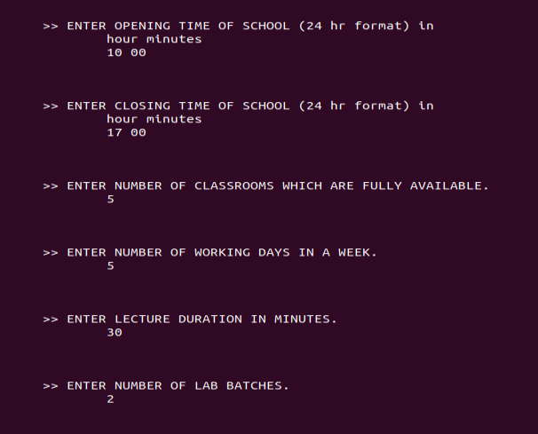

# School/College Schedule Generator
### :heavy_check_mark: Working

## Information
It is a CLI based timetable generator, which takes in information about classes, subjects, credits, labs, teachers' availability, etc and creates timetable for each of the classes. It employs randomization-based heuristic as its generation strategy.
## Functionality
- The tool consumes the information about the resource-availability(teachers and classrooms), subjects & credits, and standards from readable text files.
- It requests additional parameters like school/college opening/closing timings, lecture-duration, etc at run-time.
- The feasibility of scheduling is checked beforehand using a sparseness heuristic, if feasible the tool proceeds with the generation task.
- It generates the schedule and translates that into two views viz. *standard-wise schedule and teacher-wise schedule*. The same are saved in csv files.
## Implementation 
- The heuristic approach used for generating the timetable works as following:
  - Generate the schedule for each of the standard, in an unconstrained manner
  - Then superimpose those individual schedules and simultaneously apply and handle the hard-constraints like classroom-clashes, teachers' availability, etc.
    - If the violations can be resolved using the resolution-strategy, then the generator treats the adjusted schedule as the final solution and stops.
    - If the violations cannot be resolved, then the generator randomizes a few parameters and tries again.
- The tool is written using standard C libraries.
## Dependencies
- GCC

**Details about the input/output structure and other parts of the tool can be found [here](additional-details.md).**

## Instructions
Execute below instructions to run the sample example:
- ```$ make```
- ```$ ./schedule-generator sample_input_subjects sample_input_teachers sample_input_standards```
- Follow the UI instructions when the tool requests additional information. The values for the sample example are shown in the below snapshot-


